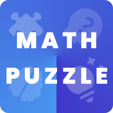

<!-- PROJECT LOGO -->
 

  

  <h3 align="center">Math Matrix : Train Your Brain, Improve Math Skill</h3>

  

<!--      -->
    
  

<h3 align="center">Math Matrix is a Math Game that tries improvise your math skills in a fun way.</h3>
 

[![Product Name Screen Shot][product-screenshot]](https://example.com)

Simple math games to learn, improve you math skills. This game is easy to play and target everyone from kids to adults. Every level is design in a way to challenge your mind at every step. 

## This game is divided in 3 main categories 

**Math Puzzle** - This category revolves around basic calculation like addition, subtraction, division and multiplication. Each game in this category includes simple calculation with different approach. So you're playing with numbers and signs while fighting with time.

**Memory Puzzle** - This category focuses on not just calculation but to memorize numbers and signs before applying calculation to them. It tries to engage you in a way to solve this calculation with recalling numbers and signs in gradual manner.

**Train Your Brain** - Train your Brain tries to enhance your logical thinking with keeping time in mind. There can single or multiple ways to reach your query but you need to find best possible ways to earn best score.

Overall all this puzzle tries to engage you in a different way to improve your memory, attention, speed, reaction, concentration, logic and more. With each level it becomes more and more complex and try to take best out of you.

### Games in Math Puzzle
**1) Calculator** : A simple calculation of addition, subtraction, division and multiplication. You'll be given an equation and you need to find correct answer in 5 seconds. 
**2) Guess the sign** : You need to complete equation by placing correct sign between two numbers to reach to the given answer.  
**3) Correct Answer** : You'll be given 4 options and one incomplete equation with answer. You need to place correct number to complete given equation. 
**4) Quick Calculation** : It's same like calculator where you need to perform basic equation but you're racing with time.Faster you answer, more time will be given and more equation you can solve .You need to fight with time to reach to break your own high score.

### Games in Memory Puzzle
**1) Mental Arithmetic** : Numbers and signs will be shown one by one for few seconds, you need to remember those and give correct answer. This focuses on your memory and calculation at same time. 
**2) Square Root** : You need to find Square root of number for given options. With each increasing level you'll be having tough equation to solve. 
**3) Mathematical pairs** : One card have equation while other card have correct answer, but this will be places randomly in Grid. You need to select equation and correct answer to remove it from Grid. 
**4) Math Grid** : You'll be given an answer and a 9x9 grid. You need to select numbers from grid one by one to reach the given number. Find the best possible way to solve max answer from 9x9 grid. 

### Games in Train Your Brain
**1) Magic Triangle** : This is 3x3 and 4x4 triangle where you need to place 6 number in a way that sum of each side should be equal to given number. 
**2) Picture Puzzle** : Each shape represents a number. You need find number related to each shape and solve the last equation. 
**3) Number Pyramid** : In a number pyramid, the numbers on the lower layers determine the numbers above them. Sum of two consecutive cell would be placed on top cell. 

## Built With
This application built [Flutter](https://flutter.dev/). Flutter is cross-platform open source mobile framework built by Google. Flutter use Dart as a primary language which is highly scalable and easy codebase.
* [Getting started with Flutter](https://flutter.dev/docs).
* [Dart](https://dart.dev/)

<!-- ROADMAP -->
## Roadmap

See the [open issues](https://github.com/jaysavsani07/math-metrix/issues) for a list of proposed features (and known issues).

<!-- CONTRIBUTING -->
## Contributing

Contributions are what make the open source community such an amazing place to be learn, inspire, and create. Any contributions you make are **greatly appreciated**.

1. Fork the Project
2. Create your Feature Branch (`git checkout -b feature/AmazingFeature`)
3. Commit your Changes (`git commit -m 'Add some AmazingFeature'`)
4. Push to the Branch (`git push origin feature/AmazingFeature`)
5. Open a Pull Request

<!-- LICENSE -->
## License

Distributed under the MIT License. See [LICENSE](https://github.com/jaysavsani07/math-metrix/blob/master/LICENSE) for more information.

<!-- CONTACT -->
## Contact

[Nividata Consultancy](https://www.nividata.com/contact/)

## Developer

<!-- ACKNOWLEDGEMENTS -->
## This app using following awesome open source libraries

* [provider](https://pub.dev/packages/provider)
* [vsync_provider](https://pub.dev/packages/vsync_provider)
* [get_it](https://pub.dev/packages/get_it)
* [shared_preferences](https://pub.dev/packages/shared_preferences)
* [flutter_svg](https://pub.dev/packages/flutter_svg)
* [tuple](https://pub.dev/packages/tuple)
* [package_info](https://pub.dev/packages/package_info)

<!-- MARKDOWN LINKS & IMAGES -->
<!-- https://www.markdownguide.org/basic-syntax/#reference-style-links -->
[product-screenshot]: https://github.com/jaysavsani07/math-metrix/blob/master/assets/images/banner.png
